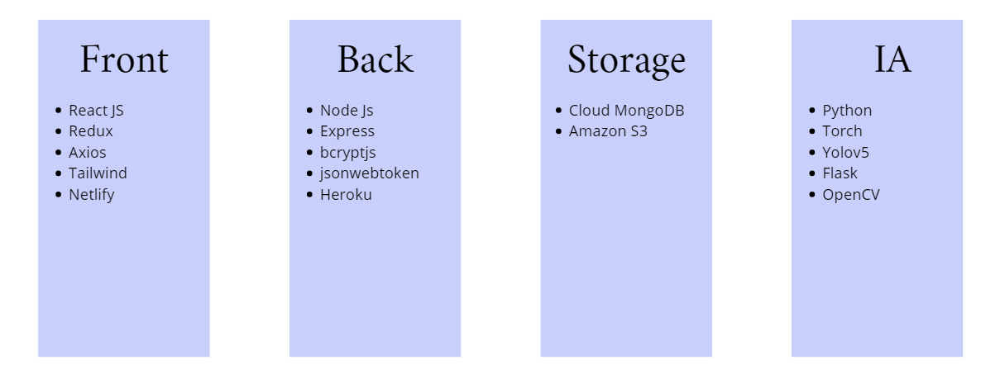
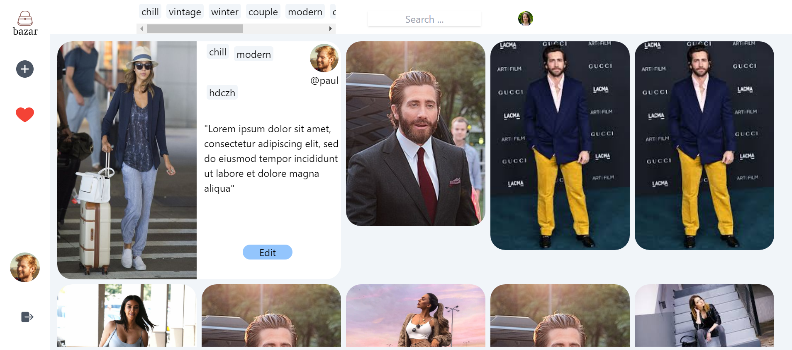

# Bazar

Bazar is a student project.

# Idea

The idea of the project is to create interactive images and videos. The products displayed online are rarely identified. The idea of Bazar is to reference the products on the images. When a product of a social network post or an advertisement appeals to a user, he just has to click on it to buy it

# Stack

# Web APP

link : https://cool-otter-b6e1a8.netlify.app

Home

Profile Page

Pin page

# Clickable image/video

Model used to detect clothes : Yolov5

Database : DeepFashion (https://mmlab.ie.cuhk.edu.hk/projects/DeepFashion/AttributePrediction.html)

